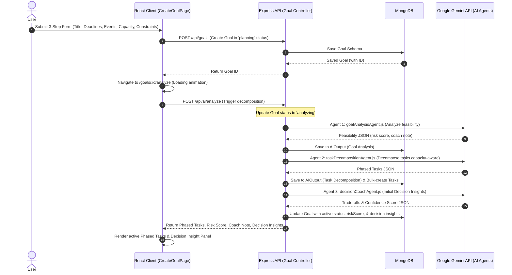
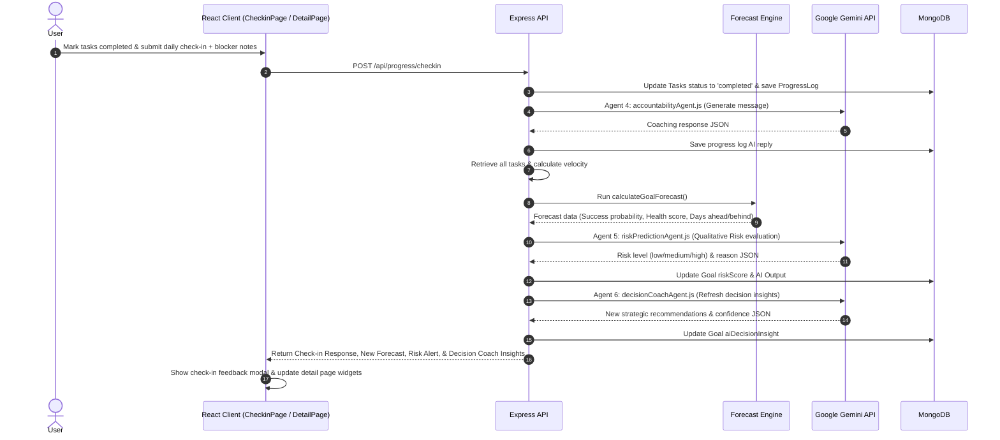

# Deadline Guardian AI 🛡️ — System Documentation

Welcome to the comprehensive documentation for **Deadline Guardian AI**. This guide outlines the project's goals, architectural flow, features, and core intelligence engines to help developers, designers, and stakeholders easily understand what was built and how the system works.

---

## 🎯 Project Alignment & Solutions

### The Problem
Traditional productivity and task management tools are **passive**. They function as simple todo lists where task completion is self-reported, and deadlines are simple date labels. When users hit bottlenecks, fall behind, or run into scheduling conflicts (such as exams, travel, or meetings), these tools do not help them adapt. Consequently, this leads to **deadline slippage**, **task backlog**, and **goal abandonment**.

### The Solution: Deadline Guardian AI
Deadline Guardian AI is an **intelligent, active productivity coach** powered by Google Gemini AI and a custom mathematical forecasting engine. It helps users:
1. **Analyze Feasibility:** Assess if a goal's timeline is realistic before starting.
2. **Auto-Generate Custom Schedules:** Decompose complex goals into day-by-day task lists tailored to the user's daily working hours, skill level, and real-life constraints.
3. **Adapt Dynamically (Deadline Rescue):** Detect when a user is falling behind and generate optimized recovery plans that drop lower-priority items, combine tasks, and fit the remaining daily capacity.
4. **Offer Strategic Guidance:** Act as a personal decision coach by recommending real-life trade-offs (e.g., advising completion of crucial milestones before an upcoming trip).
5. **Enforce Daily Accountability:** Coach the user daily based on task completion metrics and blocker notes.

---

## 🏗️ Product Architecture

Deadline Guardian AI is built on a modern **client-server-database** stack integrated with a **Coordinated Multi-Agent AI system**.

```
                   ┌──────────────────────────────────────┐
                   │         React + Vite Client          │
                   │           (Tailwind CSS v4)          │
                   └──────────────────┬───────────────────┘
                                      │ (HTTP / JSON / JWT)
                                      ▼
                   ┌──────────────────────────────────────┐
                   │          Express API Server          │
                   │               (Node.js)              │
                   └──────────┬────────────────┬──────────┘
                              │                │
                              ▼                ▼
                     ┌──────────────┐   ┌──────────────┐
                     │   MongoDB    │   │  Gemini API  │
                     │  (Mongoose)  │   │  (5+ Agents) │
                     └──────────────┘   └──────────────┘
```

### Technology Stack
- **Frontend:** React, Vite, Tailwind CSS v4, Framer Motion (for premium layout transitions/micro-animations), Canvas Confetti.
- **Backend:** Node.js, Express, JSON Web Token (JWT) Authentication, Helmet (security headers), CORS.
- **Database:** MongoDB, Mongoose schemas with compound indexes.
- **AI SDK:** `@google/genai` (Google GenAI SDK) using the `gemini-3.1-flash-lite-preview` model with retry-on-transient-error and fallback mechanisms.

---

## 🤖 Coordinated Multi-Agent AI System

The core value of the platform comes from a collection of coordinated AI Agents, each dedicated to a specific part of the productivity lifecycle:

```mermaid
graph TD
    User([User / Client UI]) -->|Submit Goal, Check-in, or Replan| API[Express API Server]
    API -->|Authenticate & Fetch Context| DB[(MongoDB Database)]
    
    subgraph Multi-Agent AI System
        FC[Forecast Engine] <-->|Mathematical Prediction| API
        
        GAA[Goal Analysis Agent] -->|Risk & Feasibility| AI_O[AI Output / Insights]
        TDA[Task Decomposition Agent] -->|Structured Phased Tasks| AI_O
        DCA[Decision Coach Agent] -->|Strategic Trade-offs| AI_O
        ACA[Accountability Agent] -->|Contextual Feedback| AI_O
        RPA[Risk Prediction Agent] -->|Dynamic Pace Risk| AI_O
        RA[Recovery / Replanning Agent] -->|Compressed Rescue Plan| AI_O
    end
    
    API <-->|Orchestrate Prompts & SDK| Multi-Agent AI System
    AI_O -.-> DB
```

### 1. Goal Analysis Agent
- **File:** [goalAnalysisAgent.js](file:///d:/7%20Sem/Deadline%20Guardian%20AI/server/src/services/gemini/goalAnalysisAgent.js)
- **Role:** Assesses initial viability.
- **Inputs:** Goal title, category, priority, available daily hours, skill level, and user context.
- **Outputs:** Feasibility rating (`achievable`, `challenging`, `at_risk`, `unlikely`), risk score (`low`, `medium`, `high`), risk reason, and a direct coaching note.

### 2. Task Decomposition Agent
- **File:** [taskDecompositionAgent.js](file:///d:/7%20Sem/Deadline%20Guardian%20AI/server/src/services/gemini/taskDecompositionAgent.js)
- **Role:** Creates capacity-aware daily plans.
- **Inputs:** Goal metadata + initial Goal Analysis risk results + user constraints/calendar events.
- **Outputs:** 2-4 logical, chronological phases of actionable, time-estimated tasks.
- **Scheduling Rules:** Ensures total task hours scheduled on any day do not exceed the user's daily capacity. It avoids scheduling regular tasks on blackout days (travel, events).

### 3. Decision Coach Agent
- **File:** [decisionCoachAgent.js](file:///d:/7%20Sem/Deadline%20Guardian%20AI/server/src/services/gemini/decisionCoachAgent.js)
- **Role:** Strategist and trade-off advisor.
- **Inputs:** Current tasks completed, remaining effort, days remaining, upcoming constraints, calendar events.
- **Outputs:** Strategic recommendations, confidence score (0-100), reasoning, and capacity warnings. Tells the user exactly what to skip or prioritize.

### 4. Accountability Agent
- **File:** [accountabilityAgent.js](file:///d:/7%20Sem/Deadline%20Guardian%20AI/server/src/services/gemini/accountabilityAgent.js)
- **Role:** Direct coach for daily check-ins.
- **Inputs:** Tasks completed today, blocker notes, overall completion percentage, days remaining.
- **Outputs:** Pragmatic feedback tailored to the goal's category (business, exam prep, startup, etc.) and suggested blocker resolutions.

### 5. Risk Prediction Agent
- **File:** [riskPredictionAgent.js](file:///d:/7%20Sem/Deadline%20Guardian%20AI/server/src/services/gemini/riskPredictionAgent.js)
- **Role:** Mathematical-agent hybrid checking progress pacing.
- **Inputs:** Completed tasks, total tasks, days elapsed, days remaining.
- **Outputs:** Dynamically updated risk score (`low`, `medium`, `high`) and explanation.

### 6. Recovery / Replanning Agent
- **File:** [recoveryAgent.js](file:///d:/7%20Sem/Deadline%20Guardian%20AI/server/src/services/gemini/recoveryAgent.js)
- **Role:** Emergency deadline rescue.
- **Inputs:** List of missed/pending tasks, days remaining, daily capacity, skill level.
- **Outputs:** Compressed rescue strategy and consolidated task list. Focuses on high-impact work, combined tasks, and dropped details.

---

## 📈 Data Analytics & Forecast Engine

The system uses a custom mathematical forecasting engine in [forecastEngine.js](file:///d:/7%20Sem/Deadline%20Guardian%20AI/server/src/utils/forecastEngine.js) to provide real-time metrics.

### Key Calculations & Algorithms

1. **Task Velocity (Hours Completed per Day):**
   $$\text{Historical Velocity} = \frac{\text{Estimated Hours Completed}}{\text{Days Elapsed}}$$
   
2. **Effective Velocity Blend:**
   Rather than trusting raw self-reported capacity or raw history alone, the system blends them:
   $$\text{Effective Velocity} = (\text{Historical Velocity} \times 0.7) + (\text{Daily Capacity} \times 0.3)$$
   *(Clamped to a minimum of 0.5 hours/day and maximum of 16 hours/day to keep predictions realistic).*

3. **Days Ahead or Behind:**
   $$\text{Expected Days Needed} = \left\lceil \frac{\text{Estimated Hours Remaining}}{\text{Effective Velocity}} \right\rceil$$
   $$\text{Days Ahead/Behind} = \text{Days Remaining} - \text{Expected Days Needed}$$

4. **Success Probability Score:**
   - **If Ahead/On Track:** 
     $$\text{Success Probability} = 75\% + (\text{Days Ahead} \times 5\%)$$
   - **If Behind:** 
     $$\text{Success Probability} = 70\% + (\text{Days Behind} \times 10\%)$$
   *(Bounded between $5\%$ and $99\%$).*

5. **Deadline Health Score:**
   Combines three weights:
   - **Progress Weight (25%):** Completion percentage $\times 25$
   - **Probability Weight (50%):** Success Probability $\times 0.5$
   - **Workload Capacity Weight (25%):** Evaluates remaining effort vs. capacity. If the user needs more than 1.2x their daily hours to complete, the weight decreases.

6. **Goal Priority Ranking:**
   Computes an urgency and risk priority score for each goal to order them on the dashboard:
   $$\text{Priority Score} = \text{Urgency Score} + \text{Risk Weight} + \text{Base Priority Weight} + \text{Effort Weight}$$

---

## 📱 Complete Feature List

1. **User Authentication & Profiles:** Register and authenticate securely with JWT. Saves user details and links dashboard views.
2. **Dashboard HUD (Heads-Up Display):**
   - **Global Statistics Widget:** Renders active commitments count, completed rate, and next-action advice.
   - **Smart Focus Matrix:** Automatically ranks goals based on deadline health, telling the user which project needs immediate attention.
   - **Goal Navigator:** Cards displaying title, category, progress bars, success probability, and risk labels with glassmorphism layout and active hover transitions.
3. **Smart 3-Step Goal Creator:**
   - **Step 1:** Define goal title, category, priority, and current skill level.
   - **Step 2:** Choose target deadline, daily working hours, and insert upcoming fixed calendar events (e.g., exams, job interviews).
   - **Step 3:** Enter blackout constraints (e.g., family trips, hackathons) and descriptive context (custom notes).
4. **Animated AI Plan Generator:** Displays loading status animations tracking the execution flow of the **Goal Analysis** and **Task Decomposition** agents.
5. **Phased Task Breakdown Board:** Displays tasks separated into distinct project phases, tracking completion status, estimation hours, and countdown timers.
6. **AI Decision Coach Panel:** Prominently displays real-time strategic recommendations, reasoning summaries, and confidence gauges directly on the goal detail page.
7. **Interactive Daily Check-ins:** Allows logging today's progress, leaving customizable blocker notes, and immediately receiving context-aware Accountability Coach messages.
8. **Deadline Rescue Replanning Portal:** Enables a user whose goal is flagged as "Medium" or "High" risk to preview a compressed recovery plan, showing side-by-side forecasts of completion probability, before & after metrics, risk drivers, and a button to apply the plan.
9. **Confetti Completion Celebration:** Confetti animations, final coach summary review, and a completion dashboard when marking a goal as completed.
10. **Google Calendar Connection & Sync:** Connect external calendars via OAuth2 to automatically load exams, trips, and interviews, calculating capacity overlap in real-time.

---

## 🔄 System Flow: Frontend to Backend

Below are execution traces illustrating the interactions between components.

### A. Goal Creation & Initial Plan Generation Flow



### B. Daily Check-in & Dynamic Risk Update Flow



---

## 🗄️ Database Models & Schema Design

All schemas are built in mongoose and reside in the [server/src/models](file:///d:/7%20Sem/Deadline%20Guardian%20AI/server/src/models) folder:

### 1. User Model (`User.js`)
Stores user profiles and passwords encrypted via `bcryptjs`.
- `name`: String, required
- `email`: String, unique index, required
- `password`: String, required
- `googleAccessToken`: String
- `googleRefreshToken`: String
- `googleTokenExpiry`: Date
- `googleCalendarConnected`: Boolean
- `timestamps`: true

### 2. Goal Model (`Goal.js`)
Tracks the central goal characteristics, timeline rules, and AI decision insights.
- `userId`: ObjectId ref `'User'`, required, index
- `title`: String, required, max length 200
- `category`: Enum (`exam_prep`, `job_interview`, `project`, `skill_learning`, `work_deadline`, `personal_commitment`, `business_startup`, `event_planning`, `other`)
- `deadline`: Date, required
- `priority`: Enum (`low`, `medium`, `high`, `critical`)
- `dailyHours`: Number, min 0.5, max 16, default 3
- `skillLevel`: Enum (`beginner`, `intermediate`, `advanced`)
- `context`: String, max length 2000
- `status`: Enum (`planning`, `analyzing`, `active`, `completed`, `archived`)
- `riskScore`: Enum (`low`, `medium`, `high`, null)
- `constraints`: Array of:
  - `type`: Enum (`travel`, `exam`, `interview`, `meeting`, `family_event`, `work_deadline`, `hackathon`, `other`)
  - `title`: String
  - `date`: Date
  - `duration`: String
  - `notes`: String
- `events`: Array of:
  - `name`: String
  - `date`: Date
  - `time`: String
- `aiDecisionInsight`:
  - `summary`: String
  - `recommendation`: String
  - `reasoning`: String
  - `confidence`: Number
- `timestamps`: true
- **Indexes:** Compound index on `{ userId: 1, status: 1 }`

### 3. Task Model (`Task.js`)
Houses decomposed tasks generated by Gemini or recovery processes.
- `goalId`: ObjectId ref `'Goal'`, required, index
- `phase`: String, default `'General'`
- `title`: String, required
- `estimatedHours`: Number, default 1
- `dueDate`: Date
- `status`: Enum (`pending`, `in_progress`, `completed`, `skipped`), default `'pending'`
- `completedAt`: Date
- `order`: Number, default 0
- `timestamps`: true
- **Indexes:** `{ goalId: 1, status: 1 }`, `{ goalId: 1, dueDate: 1 }`

### 4. ProgressLog Model (`ProgressLog.js`)
Logs daily check-in histories, user blocker reports, and coach replies.
- `goalId`: ObjectId ref `'Goal'`, required, index
- `userId`: ObjectId ref `'User'`, required
- `date`: Date, required
- `completedTaskIds`: Array of ObjectIds ref `'Task'`
- `blockerNote`: String
- `aiResponse`: String
- `timestamps`: true
- **Indexes:** `{ goalId: 1, date: -1 }`

### 5. AIOutput Model (`AIOutput.js`)
Retains logs of raw JSON prompts, inputs, and outputs processed through Gemini for research and reproducibility.
- `goalId`: ObjectId ref `'Goal'`, required, index
- `agentType`: Enum (`goal_analysis`, `task_decomposition`, `accountability`, `risk_prediction`, `recovery`)
- `input`: Mixed schema
- `output`: Mixed schema
- `timestamps`: true

### 6. CalendarEvent Model (`CalendarEvent.js`)
Stores Google Calendar events mapped to specific classification tags.
- `userId`: ObjectId ref `'User'`, required, index
- `googleEventId`: String, required, index
- `title`: String, required
- `start`: Date, required
- `end`: Date, required
- `type`: Enum (`travel`, `exam`, `interview`, `meeting`, `family_event`, `work_deadline`, `hackathon`, `other`)
- `duration`: String
- `source`: String (default `"google-calendar"`)

---

## 🔀 API Specifications

All endpoints require a valid JSON Web Token passed in the `Authorization` headers (`Bearer <token>`).

### Auth Services
- `POST /api/auth/signup`
  - Body: `{ name, email, password }`
  - Response: `{ token, user: { id, name, email } }`
- `POST /api/auth/login`
  - Body: `{ email, password }`
  - Response: `{ token, user: { id, name, email } }`
- `GET /api/auth/me`
  - Response: `{ user: { id, name, email } }`

### Goal Services
- `GET /api/goals`
  - Response: `[{ Goal JSON }]`
- `POST /api/goals`
  - Body: `{ title, category, deadline, priority, dailyHours, skillLevel, context, constraints, events }`
  - Response: `{ Goal JSON }`
- `GET /api/goals/:id`
  - Response: `{ goal, tasks: [], progressHistory: [], intelligence: { predictedCompletionDate, daysAheadOrBehind, forecastStatus, successProbability, healthScore } }`
- `PUT /api/goals/:id`
  - Body: `{ title, deadline, priority, dailyHours, skillLevel, constraints, events }`
  - Response: `{ Goal JSON }`
- `DELETE /api/goals/:id`
  - Response: `{ success: true }`
- `POST /api/goals/:id/complete`
  - Response: `{ success: true, goal }`

### AI Orchestrator Services
- `POST /api/ai/analyze`
  - Body: `{ goalId }`
  - Response: `{ riskScore, riskReason, coachNote, feasibility, phases: [], tasksCreated, aiDecisionInsight }`
- `POST /api/ai/checkin-analyze`
  - Body: `{ goalId, completedTasks: [], blockerNote }`
  - Response: `{ message }` (Accountability feedback)
- `POST /api/ai/replan`
  - Body: `{ goalId, missedTaskIds: [] }`
  - Response: `{ recoveryPlan: { message, currentProgress, riskAssessment, rescueStrategy, recoveredTimeline, successProbabilityBefore, successProbabilityAfter, improvement, riskDrivers: [], revisedTasks: [] } }`
- `POST /api/ai/replan/accept`
  - Body: `{ goalId, revisedTasks: [] }`
  - Response: `{ success: true, tasksCreated }` (deletes non-completed tasks and overwrites them with the rescue tasks)
- `POST /api/ai/risk`
  - Body: `{ goalId }`
  - Response: `{ riskScore, reason }`

### Progress Services
- `POST /api/progress/checkin`
  - Body: `{ goalId, date, completedTaskIds: [], blockerNote }`
  - Response: `{ success: true, log, coachFeedback }`
- `GET /api/progress/:goalId/history`
  - Response: `[{ ProgressLog JSON }]`

### Dashboard Services
- `GET /api/dashboard`
  - Response: `{ stats: { activeGoals, completedGoals, successRate, averageHealth }, rankedGoals: [{ priority, goal, reason, priorityScore }] }`

### Google Calendar Services
- `GET /api/calendar/auth/url`
  - Response: `{ url }` (OAuth redirect link)
- `GET /api/calendar/auth/callback`
  - Request Query: `?code=...&state=...`
  - Action: Exchanges code, connects calendar, redirects to frontend dashboard.
- `POST /api/calendar/disconnect`
  - Response: `{ success: true }`
- `POST /api/calendar/sync`
  - Response: `{ success: true, count }`
- `GET /api/calendar/intelligence`
  - Request Query: `?goalId=...`
  - Response: `{ events: [], totalConflictHours, impactAnalysis: { capacityReducedText, probabilityChangedText, beforeProbability, afterProbability, delta } }`

---

## 🗂️ Workspace Directory Layout

Below is the file architecture representing the modular structure of the repository:

```
Deadline Guardian AI/
├── client/
│   ├── src/
│   │   ├── components/
│   │   │   ├── ai/
│   │   │   │   ├── AICoachPanel.jsx    # Strategic decision insights widget
│   │   │   │   ├── CalendarIntelligenceCard.jsx # Google Calendar timeline conflicts card
│   │   │   │   ├── CoachingPulse.jsx   # Interactive AI Avatar Pulse effect
│   │   │   │   └── RiskAlert.jsx       # Deadline warning notification
│   │   │   ├── layout/
│   │   │   │   ├── Navbar.jsx          # Header navigation
│   │   │   │   └── ProtectedRoute.jsx  # Auth guard wrapper
│   │   │   └── ui/                     # Reusable form/layout elements
│   │   ├── pages/
│   │   │   ├── AIPlanPage.jsx          # Animated progress planner load screen
│   │   │   ├── CheckinPage.jsx         # Daily check-in checklists
│   │   │   ├── CompletionPage.jsx      # Celebratory final summary layout
│   │   │   ├── CreateGoalPage.jsx      # Multi-step goal configurations
│   │   │   ├── DashboardPage.jsx       # Global HUD overview and rank grid
│   │   │   ├── GoalDetailPage.jsx      # Phased task progress monitor
│   │   │   ├── LoginPage.jsx           # App session login
│   │   │   ├── NotFoundPage.jsx        # Fallback error router page
│   │   │   ├── ReplanPage.jsx          # "Deadline Rescue" preview & activate
│   │   │   ├── SettingsPage.jsx        # App configuration & calendar connection
│   │   │   └── SignupPage.jsx          # Profile setup
│   │   ├── services/
│   │   │   └── api.js                  # Axios client calls configured
│   │   ├── stores/
│   │   │   └── authStore.js            # Zustand authentication actions
│   │   ├── utils/                      # UI helpers and layout parsers
│   │   ├── App.jsx                     # Application Route registration
│   │   ├── index.css                   # Custom glassmorphism design variables
│   │   └── main.jsx                    # React index DOM renderer
│   ├── package.json
│   └── vite.config.js
│
├── server/
│   ├── src/
│   │   ├── config/
│   │   │   ├── db.js                   # Mongoose database connector
│   │   │   └── env.js                  # Configuration key validation
│   │   ├── controllers/
│   │   │   ├── aiController.js         # Coordinates AI actions & agents
│   │   │   ├── authController.js       # Validates & handles login sessions
│   │   │   ├── calendarController.js   # Manages calendar sync & OAuth callback
│   │   │   ├── dashboardController.js  # Compiles ranked list statistics
│   │   │   ├── goalController.js       # Creates & updates goal entities
│   │   │   └── progressController.js   # Saves check-ins & computes logs
│   │   ├── middleware/
│   │   │   ├── auth.js                 # Verifies JWT validation
│   │   │   └── errorHandler.js         # Express global error handler
│   │   ├── models/
│   │   │   ├── AIOutput.js             # Mongoose AI logs cache
│   │   │   ├── CalendarEvent.js        # Mongoose Calendar event schema
│   │   │   ├── Goal.js                 # Mongoose Goal schema
│   │   │   ├── ProgressLog.js          # Mongoose Check-in history
│   │   │   ├── Task.js                 # Mongoose Task item schema
│   │   │   └── User.js                 # Mongoose User credentials
│   │   ├── routes/                     # Router API bindings
│   │   │   ├── ai.js
│   │   │   ├── auth.js
│   │   │   ├── calendar.js
│   │   │   ├── dashboard.js
│   │   │   ├── goals.js
│   │   │   └── progress.js
│   │   ├── services/
│   │   │   └── gemini/
│   │   │       ├── client.js           # Gemini API client wrapper & retry backoff
│   │   │       ├── goalAnalysisAgent.js
│   │   │       ├── taskDecompositionAgent.js
│   │   │       ├── decisionCoachAgent.js
│   │   │       ├── accountabilityAgent.js
│   │   │       ├── riskPredictionAgent.js
│   │   │       └── recoveryAgent.js
│   │   ├── utils/
│   │   │   ├── calendarHelper.js       # Event classifiers & overlap conflict hours
│   │   │   └── forecastEngine.js       # Core math forecast logic
│   │   ├── app.js                      # Express middleware register
│   │   └── index.js                    # Database bootstrap & server listen
│   ├── package.json
│   └── .env
└── README.md
